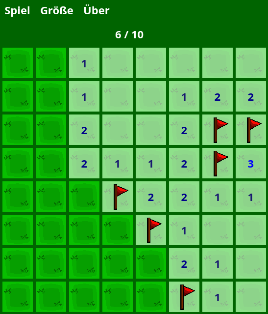
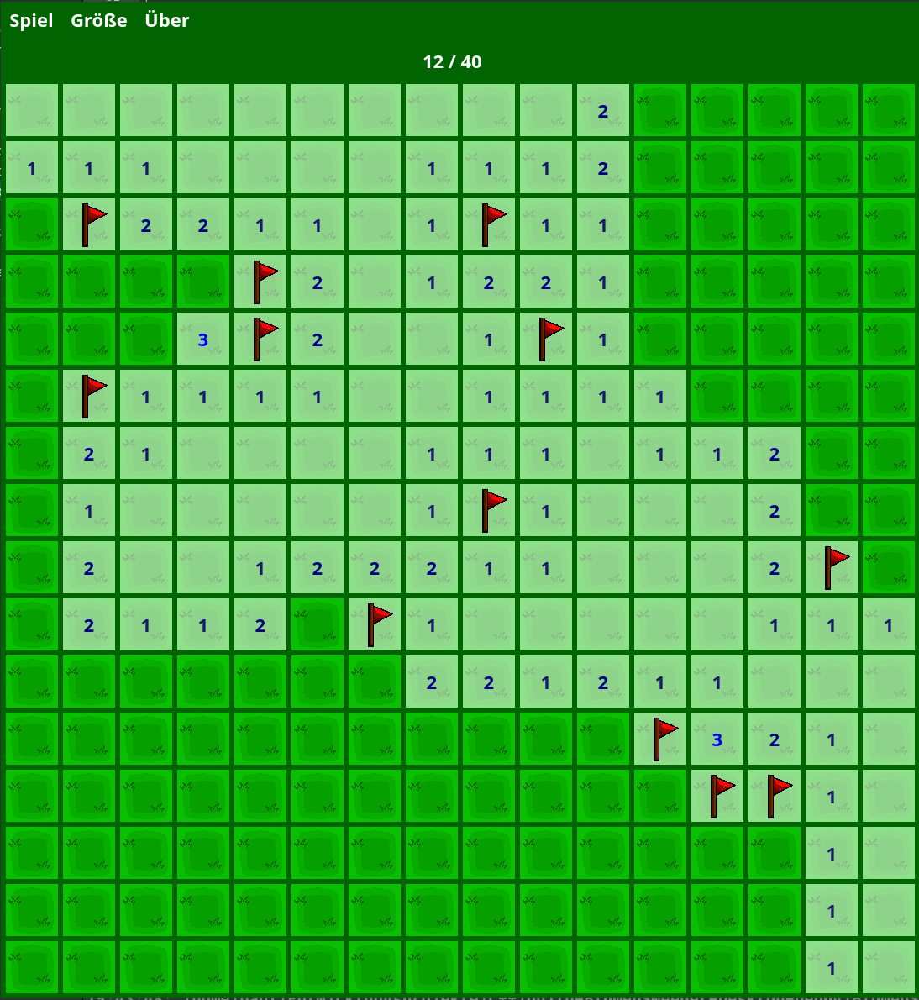
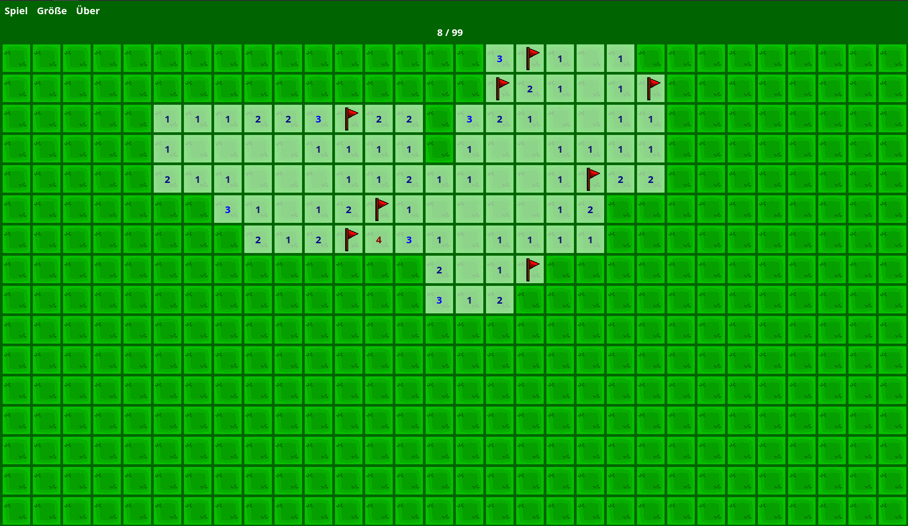
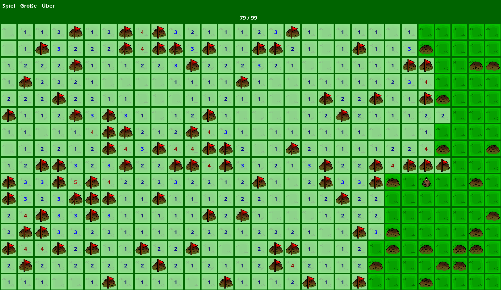
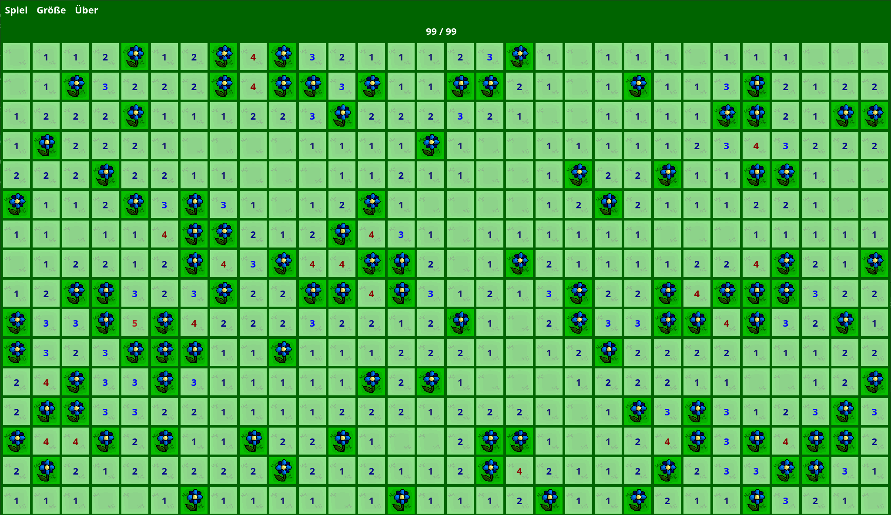

# PlanlosesPflanzen
Minesweeper-like game with flower bulbs instead of mines.

## Gameplay
Last year you planted flower bulbs randomly in your garden. Unfortunately you forgot all the locations! Now you need to recover the free positions. Whenever you uncover a free square, you find out how many flower bulbs are hidden under the adjacent squares. In case you uncover a square with a flower bulb, you loose.

### Board Generation
At the moment the program uses a naive implementation for board generatioin, that does not guarantee a deterministic solution.

## Screenshots
### Small Game Board

### Medium Game Board

### Large Game Board

## Copyright and License
### Source Code

Copyright 2022 Paul Fuhrmann

This program is free software: you can redistribute it and/or modify it under the terms of the GNU General Public License as published by the Free Software Foundation, either version 3 of the License, or (at your option) any later version.

This program is distributed in the hope that it will be useful, but WITHOUT ANY WARRANTY; without even the implied warranty of MERCHANTABILITY or FITNESS FOR A PARTICULAR PURPOSE. See the GNU General Public License for more details.

You should have received a copy of the GNU General Public License along with this program. If not, see [here](http://www.gnu.org/licenses/).

### Artwork
[![CC BY-SA 4.0][cc-by-sa-shield]][cc-by-sa]

Copyright 2022 Pablo Miras

The artwork, i.e. all Portable Network Graphic files residing in the `resources/` folder, is licensed under a [Creative Commons Attribution-ShareAlike 4.0 International License][cc-by-sa].

[![CC BY-SA 4.0][cc-by-sa-image]][cc-by-sa]

[cc-by-sa]: http://creativecommons.org/licenses/by-sa/4.0/
[cc-by-sa-image]: https://licensebuttons.net/l/by-sa/4.0/88x31.png
[cc-by-sa-shield]: https://img.shields.io/badge/License-CC%20BY--SA%204.0-lightgrey.svg

